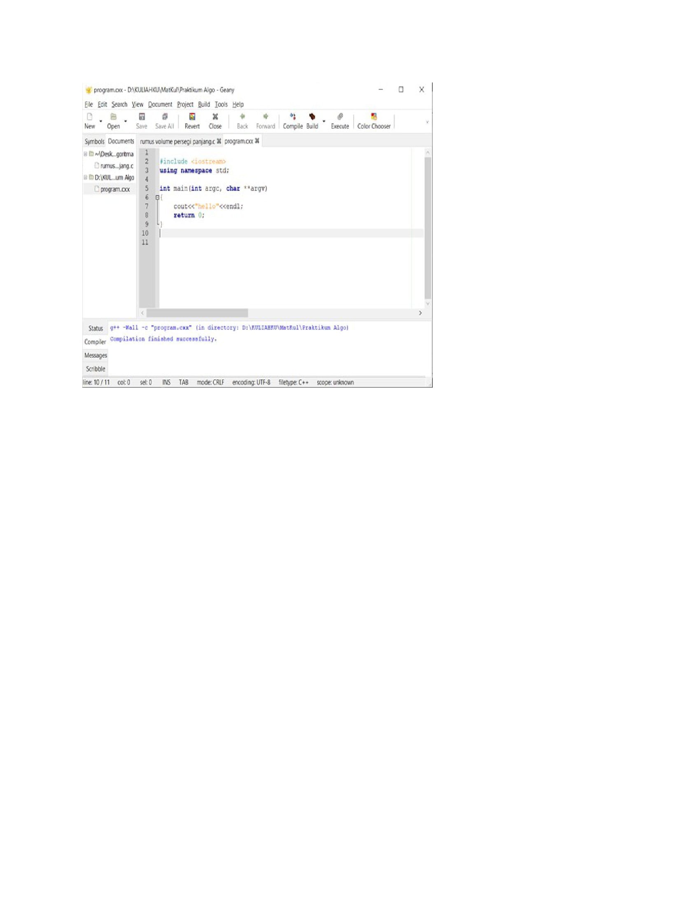

### PRAKTIKUM MINGGU 1 praktikum_algoritma_1

Pada minggu 1 telah  dipelajari cara menginstall IDE geany dan git, dimana hasilnya diupload di github pribadi saya.

## Instal geany
Berikut adalah hasil install IDE geany

(Ditampilkan gambarnya)

## Install git
Ini adalah version dari git yang telah terinstaall

(ditampilkan gambar git-nya)
